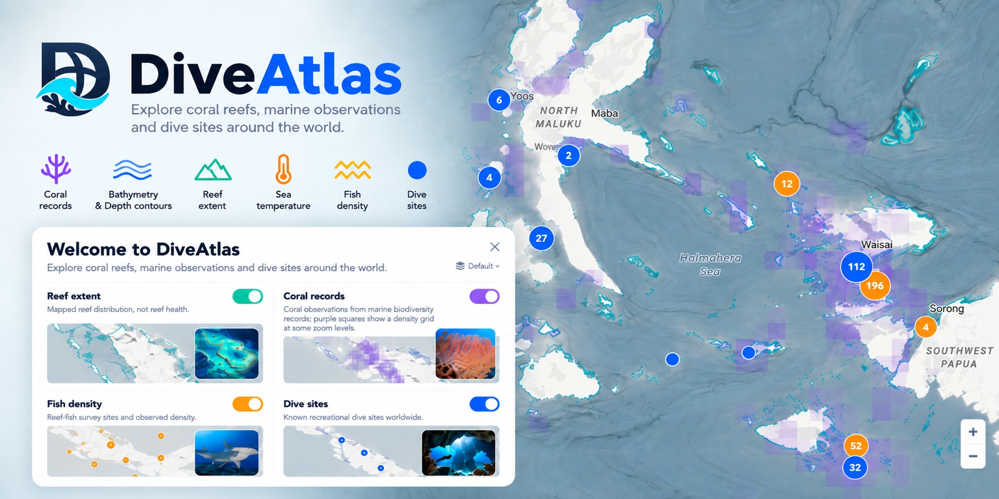

# DiveAtlas



*Project cover artwork. The supported live map layers are listed below; labels shown in the artwork may differ from the current build.*

DiveAtlas is a static-first interactive map for exploring mapped dive sites and marine geographic data around the world. It brings dive locations together with coral observations, reef extent, fish-survey density, bathymetry, depth contours, and seafloor terrain.

- **Open the map:** [diveatlas.site](https://diveatlas.site/)
- **Browse the dive-site pilot:** [/dive-sites/](https://diveatlas.site/dive-sites/)
- **Browse pilot regions:** [/regions/](https://diveatlas.site/regions/)

## Explore the map

The map combines these local/static datasets and overlays:

- **Dive sites:** mapped recreational dive locations, with stable record IDs, selected local photos, and factual details where the source record provides them.
- **Coral records:** OBIS coral observations. Derived records are screened at build time against a GEBCO land mask; cells classified as land more than 50 km from the coast are excluded from the published coral products. Source inputs remain unchanged.
- **Reef extent:** UNEP-WCMC reef geometry, served as low-zoom raster tiles and viewport-loaded vector chunks at higher zoom.
- **Fish density:** AODN / NRMN reef-fish survey locations and recorded density.
- **Bathymetry:** GEBCO_2026 seafloor context, loaded from local viewport tile atlases. Depth samples are fetched only after a map click.
- **Depth contours:** independently toggleable depth lines, generated for supported zoom levels.
- **Terrain:** an optional slope overlay derived from GEBCO bathymetry.

Bathymetry is the persistent base context and has no visibility switch. Terrain is optional; contours can be toggled separately. Layer preferences are saved locally, and share links can restore map position, visible layers, and a selected dive site. The first-visit tutorial can be reopened from the map menu.

Bathymetry and terrain describe gridded, sometimes interpolated source data. Display resolution is not a guarantee of local survey accuracy. These layers are for exploration and must not be used for navigation or safety at sea.

## Dive-site and region pages

The repository includes a small HTML-first SEO pilot generated from `data/dive-sites.js`:

- `/dive-sites/` links to the selected site pages.
- `/dive-sites/<slug>/` contains a static title, description, canonical URL, site facts, and links to its recorded region and map deep link.
- `/regions/` links to qualifying recorded country/region groups.
- `/regions/<country>/<region>/` (or `/regions/<region>/` when the country field is absent) lists the pilot sites and a coordinate range calculated from those records.

The current pilot contains 20 site pages and 2 region pages. Site selection is based on record completeness, not popularity. Generation excludes duplicate-coordinate records and requires stable identity, valid coordinates, location context, and multiple factual attributes. Region pages require at least three generated sites. Pages use source fields only; no reverse geocoding or generated descriptions are used.

Run the generator from the repository root to rebuild the pages and `sitemap.xml`:

```powershell
python tools/generate_seo_pages.py
```

Limits can be raised after reviewing the pilot, for example:

```powershell
python tools/generate_seo_pages.py --site-limit 50 --region-limit 10
```

The `dive-sites/` and `regions/` directories are generator-owned and replaced on each run. See [SEO_GENERATION.md](tools/SEO_GENERATION.md) for schema, thresholds, slug rules, and validation details. `robots.txt` allows the site and disallows only `/data/reef_tiles/`; the sitemap contains page URLs, not data or image assets. Cloudflare may serve managed robots content independently of the repository file, so verify the live response after publishing.

## Run locally

The project is a static site; there is no build step for normal map use. From the repository root, start a local static server:

```powershell
python -m http.server 8000
```

Then open [http://localhost:8000](http://localhost:8000). The map uses local data files and remote basemap/style resources, so an internet connection is needed for those external map resources.

## Rebuild data assets

Normal browsing does not run Python, download source datasets, or call a reverse-geocoding service. Python tools are for maintainers rebuilding generated assets.

### Bathymetry, contours, and terrain

`tools/build_bathymetry.py` requires `rasterio`, `numpy`, `Pillow`, and `contourpy`. It downloads the GEBCO_2026 global GeoTIFF archive (about 4 GB) into ignored `data/.build/`, then writes static viewport-addressable assets under `data/`.

```powershell
python -m pip install rasterio numpy Pillow contourpy
python tools/build_bathymetry.py
```

The current surface is capped at Z7; contours and terrain stop at Z8 because finer display pixels would imply unsupported source detail. Terrain uses a Horn 3×3 slope calculation and is generated offline; the browser only loads the precomputed atlas when the layer is enabled and in range. `data/terrain_z9_z10_demo/` is a separate bounded display/storage experiment and is not referenced by the production manifest; its overzoomed pixels do not represent higher-resolution measurements. Generated manifests and tiles belong in Git; source rasters, extracted source data, and intermediate overviews under `data/.build/` do not.

### Reef and coral products

`tools/build_local_data.py` contains the local Reef and coral build pipeline. The coral occurrence and species exporters share the inland QC policy in `tools/coral_qc.py`; `tools/validate_coral_qc.py` checks the generated outputs and regression controls. Build dependencies and cached source inputs vary by target; inspect the selected tool's header and `--help` before rebuilding. Generated snapshots, manifests, and chunks are the browser's static inputs.

## Dive-site record and photo maintenance

Rows in `data/dive-sites.js` keep their persistent UUID in field `[12]`; never regenerate IDs from names, coordinates, or row order. Field `[13]`, when present, retains retired IDs after a merge. Same-name records within 3 km may be consolidated; see [the dive-site photo guide](assets/dive-sites/README.md) before changing IDs or photos.

Approved site photos are stored as WebP at `assets/dive-sites/<siteId>/hero.webp`. Add metadata to `data/dive-site-photos.js` under the matching stable ID, including meaningful alt text, credit, source, license, and location confidence. Only verified photos for the exact site should be registered.

## Project layout

- `index.html` — map UI, styles, translations, and client-side map behavior.
- `assets/` — icons, tutorial imagery, verified dive-site photos, and the SEO-page stylesheet.
- `data/` — static dive-site records, coral snapshots/chunks, reef tiles/manifests, and bathymetry/terrain atlases.
- `dive-sites/`, `regions/` — generated SEO HTML pages.
- `robots.txt`, `sitemap.xml` — crawler policy and page URL list.
- `tools/` — local data builders, QC tools, and the SEO generator.
- `data/.build/` — ignored source caches and generated intermediates; never commit this directory.

The site remains a client-side map application. Static SEO pages do not load the map bundles or full map datasets unless a visitor follows the explicit link back to the interactive map.
