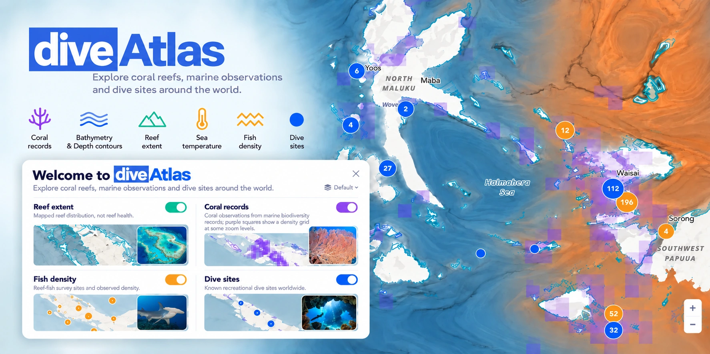

# DiveAtlas

Explore dive sites and marine map layers around the world with [DiveAtlas](https://diveatlas.site/). Search for a place, browse the map, and compare mapped marine information in one view. No account or installation is needed.

## Start exploring

1. **Find a place.** Use the search box to look for a dive site or location. Choose a result to move the map to it.
2. **Explore the map.** Drag to pan and use the zoom controls or your mouse wheel to zoom. Select a dive-site marker to see its available details.
3. **Choose what to see.** Open **Layers** to select an environmental view and turn individual overlays on or off.
4. **Share your view.** Use the share control in the top bar to copy a link to the current map view.

The map works on desktop and mobile browsers. An internet connection is needed to load the online basemap and map data.

## Map views and overlays

The environmental view selector offers **None**, **Terrain**, **Water TEMP**, and **Water Clarity**. Bathymetry remains part of the map background in every view; **None** turns off the optional environmental views.

Use the overlay switches to show or hide:

- **Depth contours** — lines representing seafloor depth.
- **Reef extent** — mapped reef areas.
- **Coral records** — recorded coral observations.
- **Fish density** — fish survey observations and recorded density.
- **Dive sites** — mapped dive locations. Select an individual site to open its available details.

Layer preferences are saved in your browser. You can change the map language and appearance from the top bar. The introductory map guide can be reopened from the menu.

## Terrain

Terrain colors show estimated seafloor slope, from gentler to steeper areas. The view is derived from global bathymetry and is useful for broad exploration of underwater terrain. It may include interpolated or lower-resolution areas, and it is not suitable for navigation.

## Water temperature

Water TEMP shows typical monthly water-temperature climatology. Choose a **depth** and **month**, then select an ocean location to see the available sampled value. The detail popup can also show a temperature profile across depths. Locations without temperature data do not show a temperature result.

The source is NOAA's [World Ocean Atlas 2023](https://www.ncei.noaa.gov/products/world-ocean-atlas). Values are long-term monthly averages, not live measurements or a forecast. Actual water temperature and dive conditions can differ. Temperature information is for exploration, not dive planning.

Temperature values can be displayed in Celsius or Fahrenheit. Depth units can be displayed in metres or feet. These controls change the displayed units, not the underlying data.

## Water clarity

Water Clarity shows typical monthly water transparency estimated from satellite data. Choose a month, then select an ocean location to see a reading where data is available. Locations without data for that month do not open a result popup.

The layer uses Copernicus Marine ZSD data for 2016–2025 at approximately 4 km source resolution. The top-bar **m/ft** control converts the legend thresholds and popup readings for display; source values and map colors remain based on metres. Actual dive visibility can differ with waves, rain, sediment, plankton, tides, currents, and local conditions. Use the layer for exploration, not dive planning or navigation.

## Understanding the map data

DiveAtlas brings together mapped dive sites and marine datasets, including coral observations, reef extent, fish surveys, bathymetry, depth contours, and terrain. Data coverage, date, and resolution vary by source and location. A missing feature means no matching data is shown there; it does not confirm that the feature is absent in the ocean.

Data sources include [OBIS](https://obis.org/) coral observations, [UNEP-WCMC](https://data-gis.unep-wcmc.org/portal/home/item.html?id=0613604367334836863f5c0c10e452bf) reef extent, [AODN / NRMN](https://nrmn.aodn.org.au/) fish surveys, [GEBCO](https://www.gebco.net/data-products/gridded-bathymetry-data) bathymetry, and [Copernicus Marine](https://marine.copernicus.eu/) water-clarity estimates. Dive-site records can have different sources; source links are shown with details when available.

Bathymetry and terrain are gridded global products. Their displayed detail does not guarantee local survey accuracy. Coral records are observations, not a complete map of coral habitat. Fish-density data reflects the available surveys, not a census of all fish. Check the source information shown with a layer or feature when evaluating a record.

**DiveAtlas is an exploration tool. Do not use it for navigation, hazard assessment, or decisions about dive safety.** Always use current local information and appropriate navigation equipment.

## Browse dive-site and region guides

- [Dive sites](https://diveatlas.site/dive-sites/) — browse selected site pages with available location details.
- [Regions](https://diveatlas.site/regions/) — browse places represented by the published dive-site pages.
