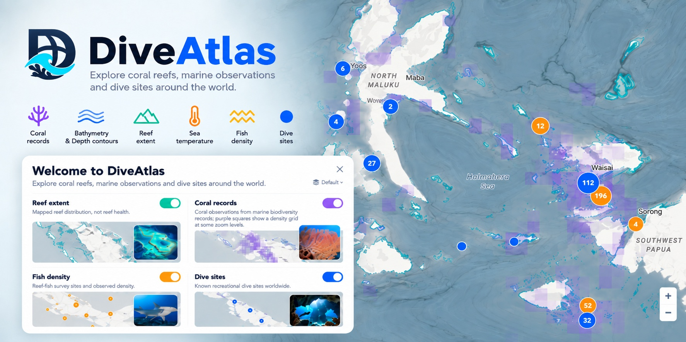

# DiveAtlas



*Project cover artwork. The supported live map layers are listed below; labels shown in the artwork may differ from the current build.*

DiveAtlas is a static-first interactive map for exploring mapped dive sites and marine geographic data around the world. It brings dive locations together with coral observations, reef extent, fish-survey density, bathymetry, depth contours, and seafloor terrain.

- **Open the map:** [diveatlas.site](https://diveatlas.site/)
- **Browse the dive-site pilot:** [/dive-sites/](https://diveatlas.site/dive-sites/)
- **Browse pilot regions:** [/regions/](https://diveatlas.site/regions/)

## Explore the map

The map combines these local/static datasets and overlays:

- **Dive sites:** mapped recreational dive locations, with stable record IDs, selected local photos, and factual details where the source record provides them.
- **Coral records:** OBIS coral observations. Derived records are screened at build time against a GEBCO land mask; cells classified as land more than 50 km from the coast are excluded from the published coral products. Source inputs remain unchanged.
- **Reef extent:** UNEP-WCMC reef geometry, served as low-zoom raster tiles and viewport-loaded vector chunks at higher zoom.
- **Fish density:** AODN / NRMN reef-fish survey locations and recorded density.
- **Bathymetry:** GEBCO_2026 seafloor context, loaded from local viewport tile atlases. Depth samples are fetched only after a map click.
- **Depth contours:** independently toggleable depth lines, generated for supported zoom levels.
- **Terrain:** an optional slope overlay derived from GEBCO bathymetry.

Bathymetry is the persistent base context and has no visibility switch. Terrain is optional; contours can be toggled separately. Layer preferences are saved locally, and share links can restore map position, visible layers, and a selected dive site. The first-visit tutorial can be reopened from the map menu.

Bathymetry and terrain describe gridded, sometimes interpolated source data. Display resolution is not a guarantee of local survey accuracy. These layers are for exploration and must not be used for navigation or safety at sea.

## Dive-site and region pages

The repository includes a small HTML-first SEO pilot generated from `data/dive-sites.js`:

- `/dive-sites/` links to the selected site pages.
- `/dive-sites/<slug>/` contains a static title, description, canonical URL, site facts, and links to its recorded region and map deep link.
- `/regions/` links to qualifying recorded country/region groups.
- `/regions/<country>/<region>/` (or `/regions/<region>/` when the country field is absent) lists the pilot sites and a coordinate range calculated from those records.

The current pilot contains 20 site pages and 2 region pages. Site selection is based on record completeness, not popularity. Generation excludes duplicate-coordinate records and requires stable identity, valid coordinates, location context, and multiple factual attributes. Region pages require at least three generated sites. Pages use source fields only; no reverse geocoding or generated descriptions are used.

Run the generator from the repository root to rebuild the pages and `sitemap.xml`:

```powershell
python tools/generate_seo_pages.py
```

Limits can be raised after reviewing the pilot, for example:

```powershell
python tools/generate_seo_pages.py --site-limit 50 --region-limit 10
```

The `dive-sites/` and `regions/` directories are generator-owned and replaced on each run. See [SEO_GENERATION.md](tools/SEO_GENERATION.md) for schema, thresholds, slug rules, and validation details. `robots.txt` allows the site and disallows only `/data/reef_tiles/`; the sitemap contains page URLs, not data or image assets. Cloudflare may serve managed robots content independently of the repository file, so verify the live response after publishing.

## Run locally

The project is a static site; there is no build step for normal map use. From the repository root, start a local static server:

```powershell
python -m http.server 8000
```

Then open [http://localhost:8000](http://localhost:8000). The map uses local data files and remote basemap/style resources, so an internet connection is needed for those external map resources.

## Run map interaction checks

The interaction suite protects marker semantics, Coral visibility, Depth Inspection gestures, hover stability, popup placement and ownership, and touch behavior. It runs the real Leaflet map against deterministic local fixtures, so it does not depend on live biodiversity data or basemap tiles.

Install the locked development dependencies and Chromium once:

```powershell
npm ci
npx playwright install chromium
```

Run the unit contracts or the complete local CI-equivalent suite:

```powershell
npm test
npm run test:interactions
```

`npm test` runs the fast interaction decision tests. `npm run test:interactions` also checks the critical-test policy, validates the static Pages artifact, and runs desktop Chromium plus Chromium with Pixel 7 touch emulation. The browser suite is not a substitute for testing OS-specific behavior on physical devices.

GitHub Actions runs this suite for pull requests and pushes to `main`. Its Pages deployment job waits for the checks to pass. Set the repository's Pages publishing source to **GitHub Actions** for this workflow to control deployment; require the **Required map interaction suite** check in branch protection to block merges with failures.

## Rebuild data assets

Normal browsing does not run Python, download source datasets, or call a reverse-geocoding service. Python tools are for maintainers rebuilding generated assets.

### Bathymetry, contours, and terrain

`tools/build_bathymetry.py` requires `rasterio`, `numpy`, `Pillow`, and `contourpy`. It downloads the GEBCO_2026 global GeoTIFF archive (about 4 GB) into ignored `data/.build/`, then writes static viewport-addressable assets under `data/`.

```powershell
python -m pip install rasterio numpy Pillow contourpy
python tools/build_bathymetry.py
```

The current surface is capped at Z7; contours and terrain stop at Z8 because finer display pixels would imply unsupported source detail. Terrain uses a Horn 3×3 slope calculation and is generated offline; the browser only loads the precomputed atlas when the layer is enabled and in range. Generated manifests and tiles belong in Git; source rasters, extracted source data, and intermediate overviews under `data/.build/` do not.

### Environmental views and typical water temperature

Default, Terrain, and Temperature are one mutually exclusive environmental-view choice. Temperature’s renderer and visual manifest load only after activation. Numeric query metadata and spatial chunks remain unloaded until a plain-ocean click. The popup uses the existing managed-popup lifecycle; marker clicks continue through the normal feature interaction path. Turning Temperature off closes its detail popup, aborts pending query fetches, and invalidates late results. Query results follow latest-click-wins and a four-chunk least-recently-used memory cache.

The source is NOAA NCEI’s [World Ocean Atlas 2023](https://www.ncei.noaa.gov/products/world-ocean-atlas). Its values are long-term climatology, not current observations. Development uses the official global 1° `decav` monthly objectively analyzed mean (`t_an`) fields, the 1955–2022 average of seven decadal means. The production view uses the 0.25° `decav91C0` monthly climate normal (1991–2020). Consult NOAA’s [WOA23 product documentation](https://www.ncei.noaa.gov/data/oceans/woa/WOA23/DOCUMENTATION/WOA23_Product_Documentation.pdf) for field and depth semantics.

The reproducible builder `tools/temperature/build.py` accepts WOA23 NetCDF and compact ASCII `.dat`/`.dat.gz` input for visual tiles. Query chunks require validated monthly NetCDF so all required levels can be read together. Automatic acquisition tries NSF NCAR GDEX first (OSDF HTTPS, then the cataloged THREDDS HTTPServer) and NOAA second. The [GDEX d285000 access page](https://gdex.ucar.edu/datasets/d285000/dataaccess/) documents its OSDF and THREDDS routes; its [NetCDF catalog](https://tds.gdex.ucar.edu/thredds/catalog/files/d285000/woa23_netcdf/catalog.html) lists the source files. Explicit providers are available with `--source gdex` or `--source noaa`; `--input` selects the local visual-tile adapter. Validated remote files and provider receipts stay in `data/.build/temperature/` for reuse. The builder validates source identity, coordinates, dimensions, field units/semantics, masks, and standard depth values. The visual raster and numeric query are separate products; browser code never reverse-decodes raster colors.

Install the Python dependencies once, then produce the Phase A eastern Indonesia validation slice from NOAA’s official 1° WOA23 product (GDEX is tried first):

```powershell
python -m pip install -r tools/temperature/requirements.txt
python tools/temperature/build.py --profile development-1deg --month 9 --depth 20 --region indonesia-test --source auto
```

Build a 12-month query dataset after acquiring all monthly NetCDF inputs (existing validated cache files are reused). The checked-in production query uses this command:

```powershell
python tools/temperature/build.py --build-query --months 1,2,3,4,5,6,7,8,9,10,11,12 --profile production-0.25deg --period decav91C0 --source auto
```

The generated `data/temperature/query/metadata.json` is small and contains no per-cell values. Query chunks are global 10° latitude/longitude regions with a one-cell border. The binary payload order is month, depth, latitude, longitude; it stores little-endian Int16 hundredths of a degree (`scale_c: 0.01`) and reserves `-32768` for missing cells. Only actual WOA23 standard depths from Surface through 50 m are included in this diver-focused query product: Surface, 5, 10, 15, 20, 25, 30, 35, 40, 45, and 50 m. Browser display rounds to 0.1°C. Lookup selects the nearest valid ocean cell within 0.75 source-grid diagonals and never interpolates across a mask. Chunks are deterministic gzip assets, fetched only after a valid map click; the four most recently used decompressed chunks are kept in memory.

The shipped query metadata describes 648 global 10° spatial chunks at 0.25° resolution. Each chunk contains the supported months and depths; the full gzip payload totals 89,554,729 B (median chunk 166,369 B, maximum 325,476 B; expanded total 300,972,672 B). A valid ocean click requests metadata and only the chunk covering that location. These are total dataset sizes, not the transfer size for one click.

If a source file is already available locally, visual-tile generation works offline:

```powershell
python tools/temperature/build.py --input D:/data/woa23_decav_t09an01.dat.gz --month 9 --depth 20 --profile development-1deg --source local
```

The local command above reads the file already on disk and needs no network. Development tiles are written separately under `data/temperature/development-1deg/`; their manifest records source period, objectively analyzed mean field, format, source filename, and validation purpose. The map displays a development-preview note while this manifest is active.

A local static server can serve `data/temperature/metadata.json` and the PNG tile tree:

```powershell
python -m http.server 8765
```

Run builder and browser checks with:

```powershell
python -m unittest discover -s tests/unit -p 'test_temperature_build.py' -v
npm run test:unit
npx playwright test tests/e2e/environmental-view.spec.js --project=desktop-chromium
```

The visual tile template is profile-rooted at `woa23/monthly/<month>/<depth>/<z>/<x>/<y>.png`; month is zero-padded `01`–`12`, and depth is `0`, `10`, `20`, `30`, or `40` metres. Query metadata records source period/resolution, actual latitude order and longitude convention, available months/depths, scaling, missing sentinel, chunk geometry, and format version. Its dimensions are read at runtime, so 1° and 0.25° grids use the same decoder.

**Data release status:** the checked-in Temperature manifest selects the complete 0.25° `decav91C0` WOA23 monthly climatology (1991–2020), with 12 months and 11 standard depths from Surface through 50 m. Its visual tiles are available through native zoom Z3. Numeric query chunks are fetched on demand after an ocean click. The September / 20 m eastern Indonesia 1° fixture remains available for development validation. These products describe long-term climatology, not current conditions, and are not suitable for local dive planning.

### Reef and coral products

`tools/build_local_data.py` contains the local Reef and coral build pipeline. The coral occurrence and species exporters share the inland QC policy in `tools/coral_qc.py`; `tools/validate_coral_qc.py` checks the generated outputs and regression controls. Build dependencies and cached source inputs vary by target; inspect the selected tool's header and `--help` before rebuilding. Generated snapshots, manifests, and chunks are the browser's static inputs.

## Dive-site record and photo maintenance

Rows in `data/dive-sites.js` keep their persistent UUID in field `[12]`; never regenerate IDs from names, coordinates, or row order. Field `[13]`, when present, retains retired IDs after a merge. Same-name records within 3 km may be consolidated; see [the dive-site photo guide](assets/dive-sites/README.md) before changing IDs or photos.

Approved site photos are stored as WebP at `assets/dive-sites/<siteId>/hero.webp`. Add metadata to `data/dive-site-photos.js` under the matching stable ID, including meaningful alt text, credit, source, license, and location confidence. Only verified photos for the exact site should be registered.

## Tutorial image maintenance

The tutorial uses resized WebP previews and square photo bubbles to keep its first-visit imagery lightweight. Rebuild these production assets from the preserved originals with Pillow:

```powershell
python -m pip install Pillow
python tools/optimize_tutorial_images.py
```

By default, the script reads `bubbles-original/` and `previews-original/` from the sibling `diveatlas-source-assets/tutorial/` archive. Keep the originals outside the published site; pass `--source-root <path>` to use a different archive, or `--preset bubble` / `--preset preview` to rebuild one group.

## Project layout

- `index.html` — map UI, styles, translations, and client-side map behavior.
- `assets/` — icons, tutorial imagery, verified dive-site photos, and the SEO-page stylesheet.
- `data/` — static dive-site records, coral snapshots/chunks, reef tiles/manifests, and bathymetry/terrain atlases.
- `dive-sites/`, `regions/` — generated SEO HTML pages.
- `robots.txt`, `sitemap.xml` — crawler policy and page URL list.
- `tools/` — local data builders, QC tools, and the SEO generator.
- `data/.build/` — ignored source caches and generated intermediates; never commit this directory.

The site remains a client-side map application. Static SEO pages do not load the map bundles or full map datasets unless a visitor follows the explicit link back to the interactive map.
